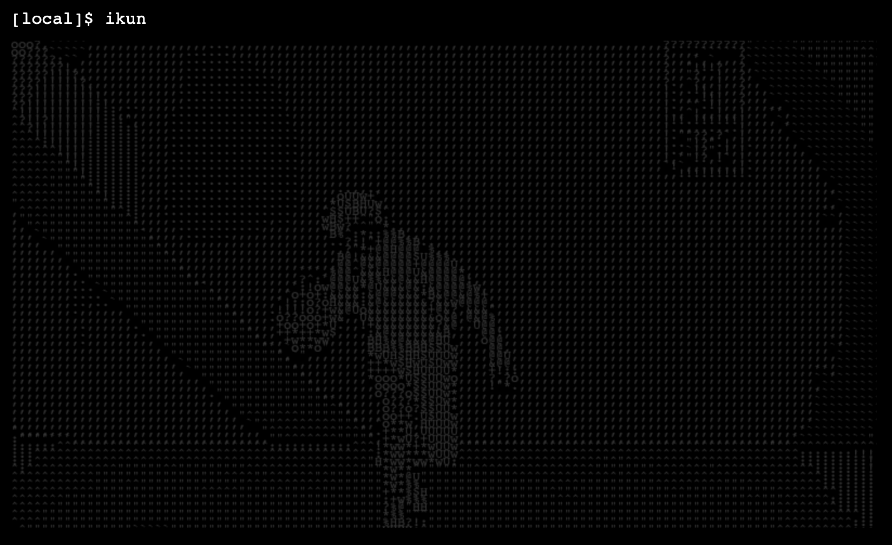

# GeekIndex - 极客范儿的浏览器主页
## 项目启动
```
pnpm install
pnpm dev
```
## GeekIndex 是什么？

一个很特别的浏览器主页，支持使用输入命令的方式来操作，目标是帮你在一个 web 终端中高效完成所有的事情！（all in one）

此外，它也是一个功能强大的 web 终端组件。开发者可以在它的基础上定制自己的 web 终端，并且可以在终端中集成任何内容！


你可以将音乐、游戏，甚至可以将自己的偶像封装到主页~




### 1 分钟上手使用

然后在网站内可输入以下命令：

```bash
baidu 马宝国
moyu
按键 Ctrl + O 触发折叠, 再按可展开
history
按键 Ctrl + L 清屏
```

使用  `help 命令英文名` 可以查询某命令的具体用法，如：`help search` 。

使用 `shortcut` 可以查看所有的快捷键。

> 完整命令用法请见：[命令手册](./doc/commands.md)


## 项目优势

### 用户

- 无需鼠标，即可快速完成操作（比如从不同平台搜索内容）
- 极简炫酷，极客范儿，Linux 的味道儿~
- 支持快捷键、帮助和输入提示，降低使用成本
- 支持定制背景等，打造你的个性主页
- 帮助你熟悉 Linux 命令，感受到编程的乐趣


### 开发者

- 可以独立使用功能丰富的 web 终端组件，或二次开发
- 可以开发自己的命令并接入系统


### 学习者

- 可以学到 web 终端的开发方式
- 可以学到系统设计知识，理解抽象和复用
- 可以学到较为规范的代码目录和格式


## 功能和特性

### web 终端

- 命令历史记录、快速执行历史命令
- 快捷键
- 清屏
- 命令输入提示
- Tab 键补全命令
- 多种格式输出
- 内置 5 种输出状态
- 命令折叠 / 展开
- 帮助手册自动生成
- 自定义配置（比如更换背景、提示开关等）
- 支持子命令


### 已支持命令

> 完整命令用法请见：[命令手册](./doc/commands.md)

- 多平台搜索 search
- 网页快速跳转 goto
- 空间管理（类似收藏夹，可以存储网页信息）
- 查看日期 date
- 翻译 fanyi
- 待办事项 todo
- 网络检测 ping
- 定时器 timing
- 更换背景 background
- 摸鱼小游戏 moyu
- 坤坤 ikun
- 其他。。。


## 技术栈

### 前端

主要技术：

- Vue 3
- Vite 2
- Ant Design Vue 3 组件库
- Pinia 2 状态管理
- TypeScript 类型控制
- Eslint 代码规范控制
- Prettier 美化代码

依赖库：

- axios 网络请求
- dayjs 时间处理
- lodash 工具库
- getopts 命令参数解析

库：getopts


依赖库：

- Axios
- NeteaseCloudMusicApi

依赖服务：

- 百度翻译 API
- 新浪壁纸 API

[点击了解后端详情](server/README.md)


## 目录结构

- public 公共静态资源
- server 后端
- src
  - assets 静态资源
  - components 组件
    - yu-terminal 终端组件
  - configs 配置
    - routes 路由
  - core 核心
    - commands 命令集
    - commandRegister 命令注册
    - commandExecutor 命令执行器
  - pages 页面
    - IndexPage.vue 主页
  - plugins 第三方依赖
  - utils 工具
  - App.vue 主页面
  - env.d.ts 环境定义
  - main.ts Vue 主文件
- .eslintrc.js 代码规范
- components.d.ts 自动生成的组件动态引入
- Dockerfile 镜像构建
- index.html 静态主页
- package.json 项目管理
- tsconfig.json TS 配置
- vite.config.ts 打包工具配置